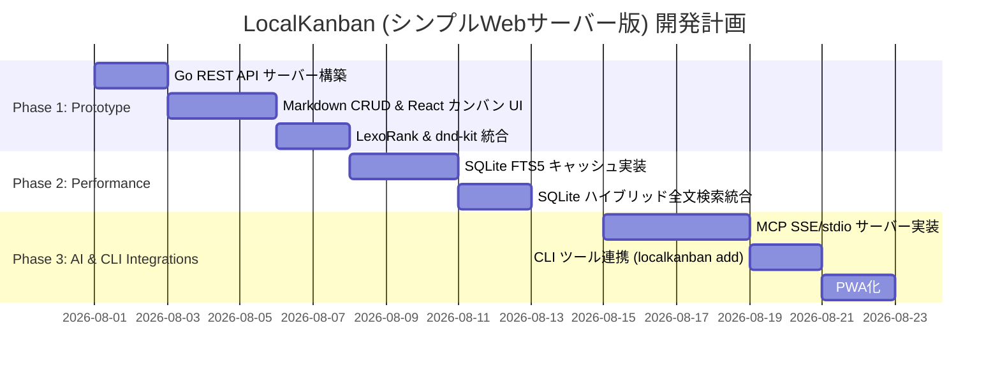

# ローカルファーストAIネイティブ・カンバンツール「LocalKanban (仮)」基本・詳細仕様書

* **文書バージョン:** 2.4.0 (SQLite FTS5 + LIKE 検索一本化・ripgrep非依存版)
* **更新日:** 2026-07-30
* **ステータス:** 承認済み / SQLite FTS5 一本化

---

## 1. システム概要 & コンセプト

`LocalKanban` は、ローカルのMarkdownファイル群をマスタデータ（SSOT: Single Source of Truth）とし、AIエージェント（MCP: Model Context Protocol）やOS・外部ツールとの高度な連携を備えた、開発者向けの超高速タスク管理ツールです。

本仕様では、開発・保守コストとシステムのシンプルさを最大化するため、**「シンプルなGo Local Webサーバー ＋ React SPA (リロードボタン同期)」** の構成を採用します。

```
 +-----------------------------------------------------------------------+
 |                         LocalKanban Web UI                            |
 |           (React 18+ / Tailwind CSS / dnd-kit / Vite SPA)             |
 |             Access via http://127.0.0.1:3737 (Reload Button)           |
 +-----------------------------------------------------------------------+
        |  Pure REST API (GET / POST / PUT / DELETE)                    ^
        v                                                               |
 +-----------------------------------------------------------------------+
 |                        Go Local Web Server                            |
 |  +--------------------+  +--------------------+  +------------------+ |
 |  |  Markdown Sync     |  |   Search Engine    |  |    MCP Server    | |
 |  |  (On API Request)  |  |   (SQLite FTS5)    |  |   (stdio / SSE)  | |
 |  +--------------------+  +--------------------+  +------------------+ |
 +-----------------------------------------------------------------------+
        |                       |                       |
        v                       v                       v
 +---------------+      +---------------+      +------------------+
 |  Local Files  |      | SQLite Cache  |      | AI Clients       |
 |  (*.md files) |      | (local.db)    |      | (Cursor, Claude) |
 +---------------+      +---------------+      +------------------+
```

### 1.1. コアバリュー

1. **Zero Lock-in (完全オープンフォーマット):**
   * ベンダーロックインを一切排除。データ構造は汎用的な標準Markdown（YAML Frontmatter + Markdown Body）。
   * Gitによるバージョン管理やDIFFの確認、エディタ（VSCode, Obsidian, Neovim等）での直接書き換えが自由自在。
2. **AI-Native (AIエージェントによるネイティブ操作):**
   * Model Context Protocol (MCP) サーバーをアプリ内に標準実装（stdio および HTTP/SSE 双方に対応）。
   * Cursor, Claude Desktop, Auto-GPT等のAIツールが直接カンバンボードのタスクを参照・追加・ステータス更新可能。
3. **Simple & Robust (超シンプル・高堅牢):**
   * WebSocketなどの常時接続・複雑なステート管理を排除し、純粋なREST APIと手動リロード / ウインドウフォーカス時自動更新で動作。
   * SQLite FTS5 および LIKE クエリによる高速なハイブリッド全文検索。

---

## 2. アーキテクチャ & 技術スタック

### 2.1. 構成フレームワーク

| 領域 | 採用技術 | 選定理由・目的 |
| :--- | :--- | :--- |
| **Backend Server** | **Go 1.22+ (net/http or Chi)** | 軽量・爆速なWebサーバー。CGO非依存（純粋Go SQLiteドライバ使用）でポータビリティ最高。 |
| **Frontend UI** | **React 18+ / Vite / TypeScript** | 高速なHMRと型安全性。静的ファイルとしてGoサーバー内に埋め込み可能 (`embed.FS`)。 |
| **Drag & Drop** | **dnd-kit** | アクセシビリティ対応かつパフォーマンスに優れた順序変更D&Dライブラリ。 |
| **Styling** | **Tailwind CSS v3+** | ディープダークモード対応、モダンで洗練されたGlassmorphism UIの構築。 |
| **Sync Mechanism** | **REST API + Reload Button** | UI上のリロードボタン、およびブラウザのウィンドウフォーカス時 (`window.onfocus`) に自動再取得。 |
| **Search & Cache** | **SQLite3 (FTS5 + LIKE)** | 構造化データの高速フィルタリングおよび全文検索。FTS5 インデックスと短語用 LIKE クエリのハイブリッド検索。 |

---

## 3. データ構造 & ファイル仕様

### 3.1. マスタデータ (Markdownファイル構造)

* **格納先:** ユーザーが指定した任意ローカルディレクトリ（例: `~/my-kanban/` やプロジェクト直下の `.kanban/`）。
* **ファイル名:** `YYYYMMDD_HHMMSS_[slug].md` または `[UUID].md` （衝突を防ぐユニーク識別子）。
* **データ形式:** YAML Frontmatter + Markdown Body

#### 構造例 (`tasks/20260728_c8f39b1a.md`)

```markdown
---
id: "c8f39b1a-4d2e-4a6b-9c8d-1e2f3a4b5c6d"
parent_id: "parent-task-uuid"  # （サブカードの場合）親タスクのID
title: "バックエンドの認証ロジック実装"
column_id: "col-in-progress"
rank: "0|i00008:"
tags:
  - "backend"
  - "go"
  - "auth"
created_at: 2026-07-28T19:00:00Z
updated_at: 2026-07-28T19:30:00Z
---

## タスク詳細
- [ ] JWTの検証ミドルウェアの作成
- [ ] クッキーベースへの移行検証

### 備考
APIの認可エラーが出る件について、チーム内での疎通確認が必要。
```

### 3.2. LexoRank 並び替えアルゴリズム

カードの順序制御には **LexoRank** を採用します。

* **原理:** 各カードに文字列型の `rank`（例: `"0|i00001:"`, `"0|i00008:"`）を割り当て、アルファベット順比較で昇順ソート。
* **メリット:** カードをAとBの間に移動する際、他の全てのカードの`rank`を更新する必要がなく、移動対象の1ファイルの`rank`のみをAとBの中間文字列に計算・更新するだけで済む（バルク書き込みゼロ）。

### 3.3. SQLite キャッシュデータベース構造 (`.local_cache.db`)

アプリケーション起動時およびファイル更新時に高速アクセス・検索用インデックスとしてSQLiteへ非同期同期されます。

```sql
-- タスクテーブル
CREATE TABLE IF NOT EXISTS tasks (
    id TEXT PRIMARY KEY,
    parent_id TEXT,        -- 親タスクID（サブカードの場合）
    title TEXT NOT NULL,
    column_id TEXT NOT NULL,
    rank TEXT NOT NULL,
    tags TEXT,             -- JSON配列文字列 e.g. '["backend","go"]'
    created_at DATETIME NOT NULL,
    updated_at DATETIME NOT NULL,
    file_path TEXT UNIQUE NOT NULL,
    custom_fields TEXT,    -- JSONオブジェクト文字列
    summary TEXT
);

-- インデックス
CREATE INDEX IF NOT EXISTS idx_tasks_column_rank ON tasks(column_id, rank);
CREATE INDEX IF NOT EXISTS idx_tasks_updated_at ON tasks(updated_at DESC);
CREATE INDEX IF NOT EXISTS idx_tasks_parent_id ON tasks(parent_id);

-- 全文検索用 FTS5 テーブル
CREATE VIRTUAL TABLE IF NOT EXISTS tasks_fts USING fts5(
    id UNINDEXED,
    title,
    content,
    tags,
    tokenize = 'trigram'
);
```

---

## 4. 機能要件詳細

### 4.1. カンバンボード画面（メインUI / PWA）

1. **動的ボード・カラム & ステータスマスター独立カスタマイズ:**
   * **ステータスマスター分離:** タスク状態（Status）をマスターとして独立定義。ユーザーが任意のステータス（例: `Backlog`, `Testing`, `Blocked` 等）を自由に追加・編集・削除可能。
   * **カラム定義:** 設定ファイル (`.kanban_config.json`) 内のカラム定義に基づきボードを生成。カラムはステータスマスターより任意のステータスを紐づけて配置。
   * **順序入れ替え・削除・非表示:** 設定モーダルから直感的に並び替え、削除、および非表示 (`visible: false`) をトグル切替可能。削除時は所属タスクを安全な代替ステータスへ自動移管。
2. **多言語 (i18n) 対応:**
   * **日本語 (`ja`) / 英語 (`en`) 完全対応:** アプリ全体のUIテキスト、ヘッダー、検索プレースホルダー、モーダル、ボタンをワンクリックで切替可能。
   * **言語永続化:** 選択された言語情報は `localStorage` および設定ファイル `.kanban_config.json` に自動保存。
3. **デザインテーマ (カラーパレット) カスタマイズ:**
   * CSS Custom Properties (CSS変数) を使用したモダンなテーマ切り替え機構。
   * プリセットテーマ (`Default Dark`, `Midnight Blue`, `Cyberpunk Neon`, `Forest Dark`, `Light Clean`) およびカスタムカラーピッカーの指定・保存。
4. **スムーズなドラッグ＆ドロップ (dnd-kit):**
   * 同一カラム内での並び替え、カラム間での移動に対応。
5. **ヘッダーコントロール:**
   * 検索バー
   * **言語切替ボタン (`JP` / `EN`):** 日本語・英語の表示切り替え。
   * **テーマ設定ボタン (`Theme`):** テーマ変更モーダルの呼び出し。
   * **ボード設定ボタン (`Board Config`):** カラムおよびステータスマスター設定モーダルの呼び出し。
   * **リロードボタン (`Reload / Sync`):** 最新データの取得・再描画。
   * 新規作成ボタン (`+ New Task`)
6. **サブカード（サブタスク）親子管理:**
   * **親子関係の保持:** 各サブカードも1つの独立したMarkdownファイル（`parent_id` 属性）として保存され、個別の詳細Markdown本文、タグ、カスタムフィールド、ステータスを保持。
   * **ボードカード上の表示:** 親カードに進捗バッジ（例: `✓ 2/4`）とプログレスバー、折りたたみ展開（アコーディオン）を表示。展開時にチェックボックスでのクイック完了切り替えやインライン追加が可能。
   * **モーダル管理:** 詳細モーダル内に「サブタスク」セクションを設置。連続追加、完了切り替え、親タスクへのパンくずリンク、サブタスク詳細の直接編集に対応。
   * **カスケード削除:** 親タスク削除時に紐づく子タスクのMarkdownファイルも自動的に連動削除。
7. **PWA (Progressive Web App) 対応:**
   * Chrome/Safariから「アプリとしてインストール」可能。

### 4.2. ローカルファイル同期メカニズム

```
[External Editor (VSCode, etc.)] ---> Edit .md ---> File System
                                                         |
[User clicks Reload or Focuses Window] -----------------> Fetch REST API ---> Read Markdown & UI Re-render
```

1. **オンデマンド同期 (fsnotify):**
   * バックグラウンドでの常時ファイル監視は行わずオンデマンド同期を基本とします。`fsnotify` については、必要であればキャッシュリビルド機能を追加します。
2. **フロントエンド同期:**
   * 複雑なリアルタイム常時接続（WebSocket等）は用いず、UIヘッダーの「リロードボタン」クリック時、またはウィンドウフォーカス時 (`window.onfocus`) にREST API経由で再読み込み。

### 4.3. 高速検索 & インデックス機能

1. **リアルタイムハイブリッド全文検索 (SQLite FTS5 + LIKE):**
   * REST API (`GET /api/tasks?q=...`) 経由で SQLite FTS5 および LIKE クエリによる高速全文検索を提供。
   * 通常キーワードは FTS5 全文検索インデックスでミリ秒単位のレスポンスを実現し、1〜2文字の日本語短語等は LIKE フォールバック検索で漏れなく検索。

### 4.4. MCP (Model Context Protocol) サーバー機能

`LocalKanban` のGoバックエンドは独立したMCPサーバー機能を内蔵します。

#### MCP Connection Modes
1. **HTTP/SSE モード:** `http://127.0.0.1:3737/mcp/sse`
2. **stdio モード:** `localkanban mcp` コマンドでSTDIOパイプ接続

#### 定義される MCP Tools

| Tool 名 | 説明 | 引数 (Parameters) |
| :--- | :--- | :--- |
| `get_tasks` | 指定されたステータス、タグ、親タスクのタスク一覧を取得 | `status` (string, optional), `tag` (string, optional), `parent_id` (string, optional), `include_subtasks` (boolean, optional), `limit` (number, optional) |
| `create_task` | 新規タスク（Markdownファイル）を作成 | `title` (string, required), `description` (string, optional), `status` (string, optional), `parent_id` (string, optional), `tags` (array of string, optional) |
| `update_task_status` | 指定タスクのステータスとRankを更新 | `task_id` (string, required), `new_status` (string, required), `target_rank` (string, optional) |
| `update_task` | 指定タスクの各種フィールド（タイトル、本文、ステータス、タグ、カスタムフィールド、親タスク等）を更新 | `task_id` (string, required), `title` (string, optional), `description` (string, optional), `status` (string, optional), `parent_id` (string, optional), `tags` (array of string, optional), `target_rank` (string, optional), `custom_fields` (array, optional) |
| `search_tasks_fts` | SQLite FTS5を利用したキーワード検索 | `query` (string, required) |

### 4.5. CLI インテグレーション

1. **CLI コマンド:**
   * `localkanban start` : サーバーの起動
   * `localkanban add "タスクタイトル"` : CLIからの超高速タスク追加

---

## 5. 開発フェーズ & ロードマップ



---

## 6. 非機能要件 & 品質基準

* **極限のシンプルさ:**
  * 接続状態の管理が不要でエラーが起きにくく、実装・デバッグ・動作テストが非常に容易。
* **ポータビリティ:**
  * Goの `go:embed` を使用し、ビルド後のWebフロントエンド資産（Reactビルド成果物）を単一のGo実行可能バイナリにパッケージング。
